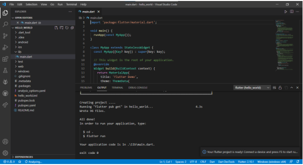
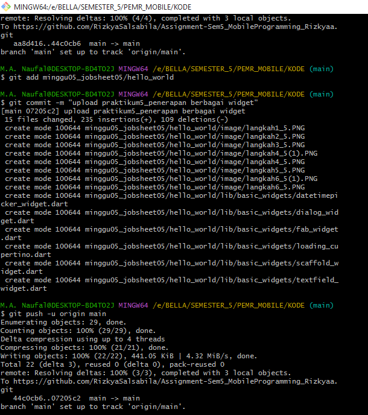
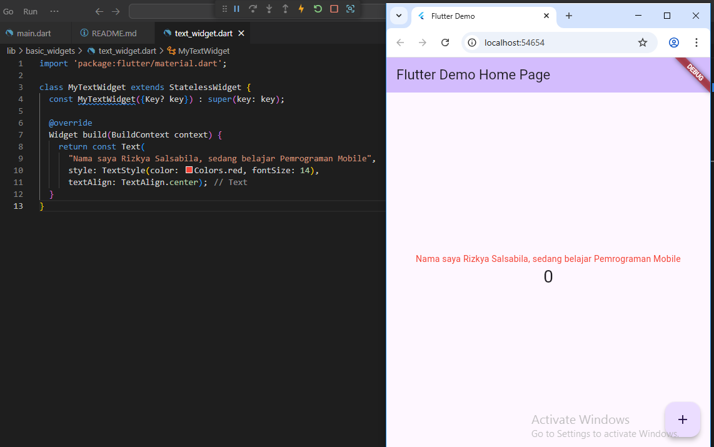
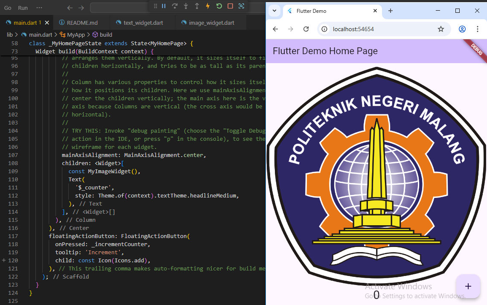
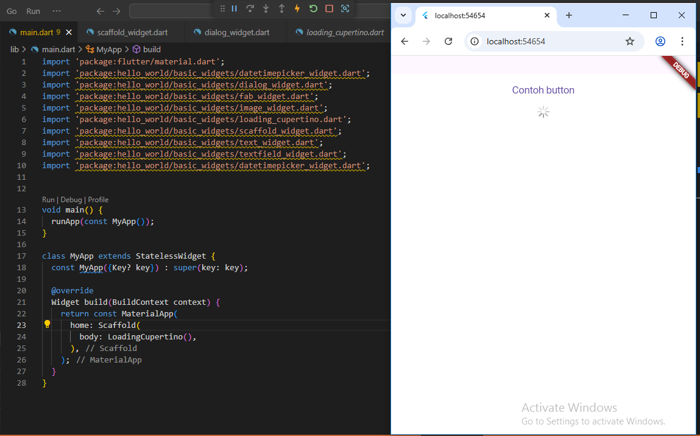
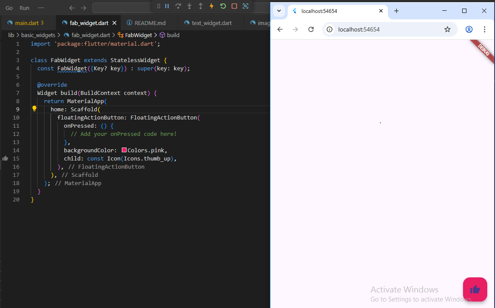
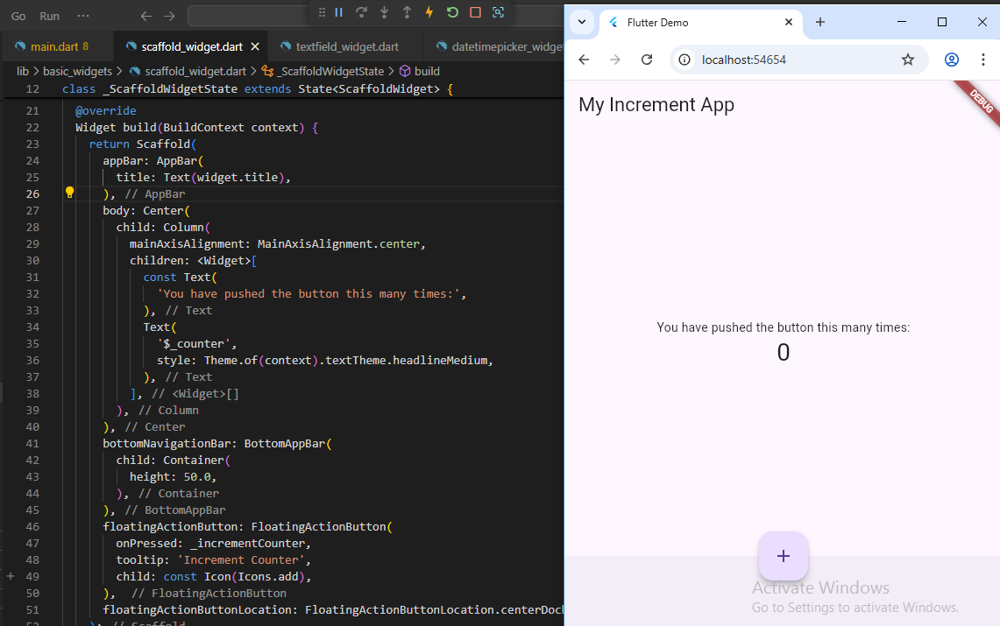
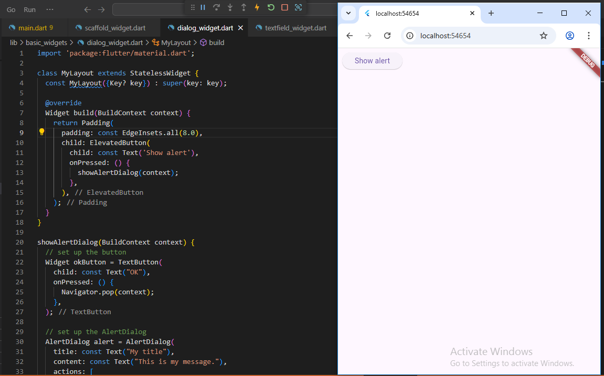
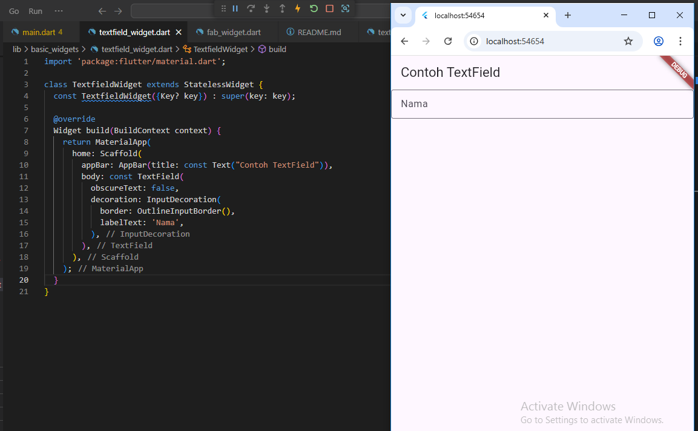
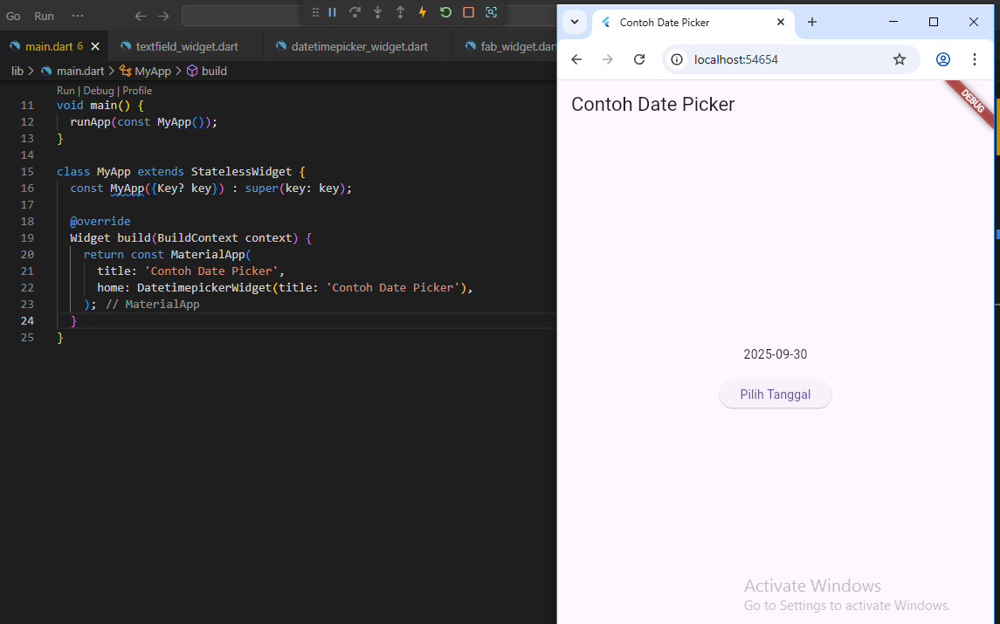

# hello_world

A new Flutter project.

## Praktikum 1: Membuat Project Flutter Baru

## Praktikum 2: Menghubungkan Perangkat Android atau Emulator
Mengetes project ketika dijalankan di Perangkat Fisik menggunakan Emulator

## Praktikum 3: Membuat Repository GitHub dan Laporan Praktikum

## Praktikum 4: Menerapkan Widget Dasar
### Langkah 1: Text Widget -> membuat custom widget sederhana berupa text

### Langkah 2: Image Widget -> menampilkan gambar di aplikasi dengan membuat folder assets untuk penyimpanan file gambar

## Praktikum 5: Menerapkan Widget Material Design dan iOS Cupertino
### Langkah 1: Cupertino Button dan Loading Bar -> menampilkan tulisan contoh button disertai icon reload

### Langkah 2: Floating Action Button (FAB) -> menampilkan tombol di bagian kanan bawah disertai dengan icon tangan berwarna pink

### Langkah 3: Scaffold Widget -> membuat kerangka tampilan aplikasi Flutter, seperti AppBar, Body, BottomNavigationBar, dan FloatingActionButton

### Langkah 4: Dialog Widget -> menampilkan dua jenis dialog yaitu AlertDialog dan SimpleDialog

.PNG)

### Langkah 5: Input dan Selection Widget -> menerima input dari pengguna aplikasi berupa text field

### Langkah 6: Date and Time Pickers -> menerapkan tanggal pada sebuah aplikasi

.PNG)
