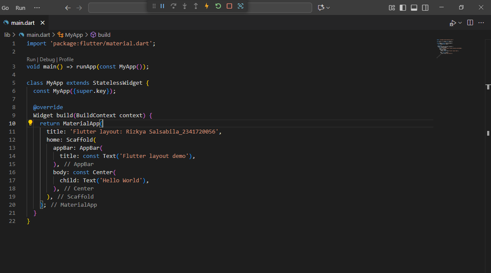
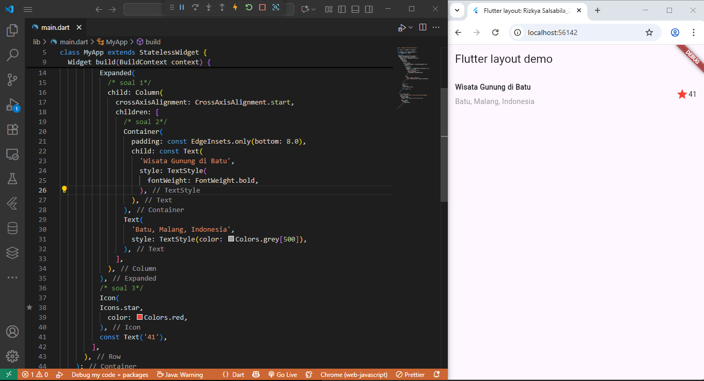
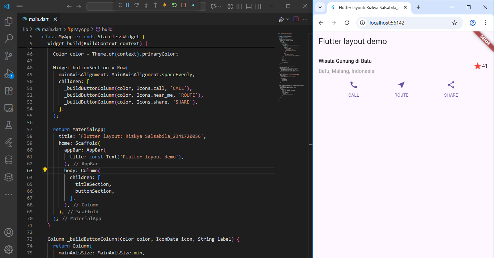
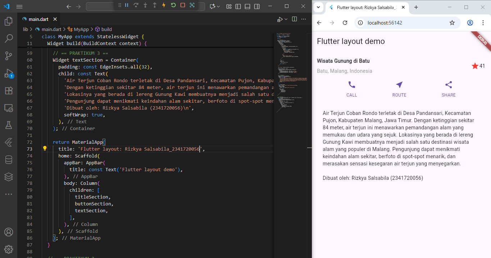
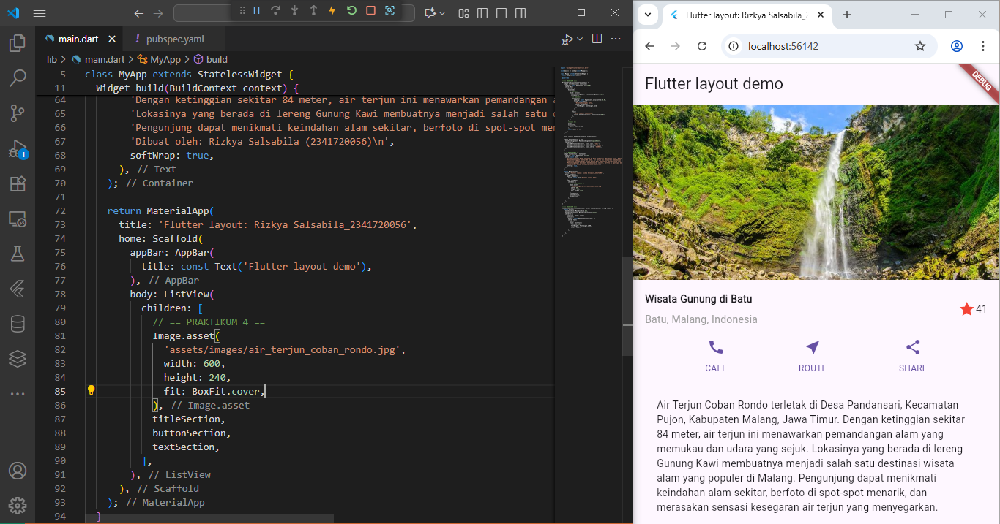
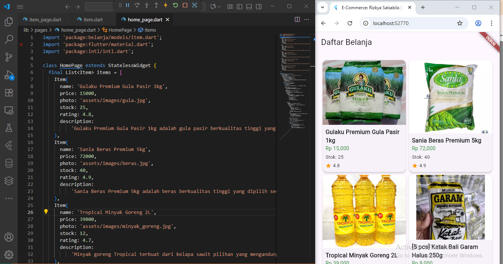
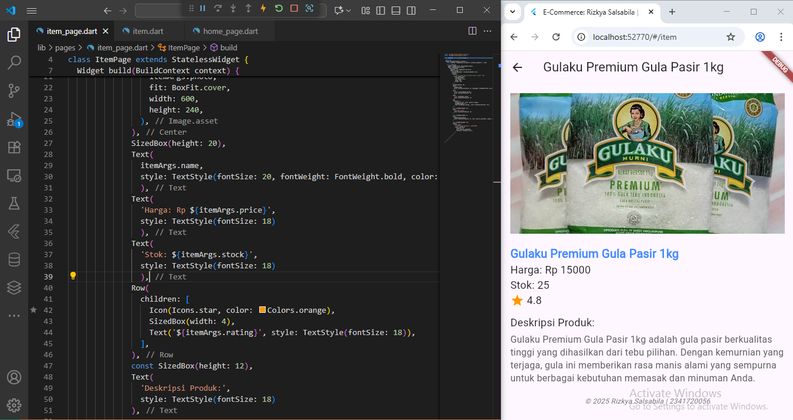

# #06 | Layout dan Navigasi

## Praktikum 1: Membangun Layout di Flutter
- Pertama, membuat project baru bernama **'layout_flutter'**
  
  
- Kedua, mengubah judul / title Aplikasi dengan Nama Lengkap + NIM. Kemudian, mengubah kode awal di main.dart seperti di modul. Dan hasilnya seperti di bawah ini :
  
  

## Praktikum 2: Implementasi Button Row
- Membuat satu baris berisi 3 tombol **CALL | ROUTE | SHARE**, disertai dengan icon yang sesuai
  

## Praktikum 3: Implementasi Text Section
- Menambahkan teks deksripsi yang sesuai di bawah **Button Row**
  

## Praktikum 4: Implementasi image section
- Membuat folder **assets/images/..** untuk menyimpan file gambar
  

## Tugas Praktikum 1
  Terimplementasi pada praktikum di atas! DONE

## Praktikum 5: Membangun Navigasi di Flutter
- Membuat project baru bernama **'belanja'**, kemudian membuat list produk yang ingin dijual dengan membuat navigasi
  

## Tugas Praktikum 2
- Melengkapi praktikum sebelumnya, agar bisa diklik untuk melihat detail produk dan membuat tombol kembali (untuk melihat keseluruhan produk)
  
