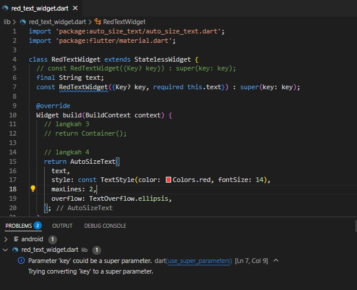

# #07 | Manajemen Plugin

## Tugas Praktikum
## 1. Selesaikan Praktikum tersebut, lalu dokumentasikan dan push ke repository Anda berupa screenshot hasil pekerjaan beserta penjelasannya di file README.md!

- Langkah 1: Buat Project Baru
  
  done, berhasil dibuat
  
- Langkah 2: Menambahkan Plugin
  
  
- Langkah 3: Buat file red_text_widget.dart
  
  
- Langkah 4: Tambah Widget AutoSizeText
  
  
- Langkah 5: Buat Variabel text dan parameter di constructor
  
  
- Langkah 6: Tambahkan widget di main.dart
  
  
## 2. Jelaskan maksud dari langkah 2 pada praktikum tersebut!
Maksud dari menjalankan kode 'flutter pub add auto_size_text' itu digunakan untuk menginstall dan menambahkan package 'auto_size_text'. Sehingga ukuran hurufnya akan mengikuti ruang tampilan otomatis.

## 3. Jelaskan maksud dari langkah 5 pada praktikum tersebut!
Maksud dari kode tersebut yaitu agar bisa menerima input teks dari luar, kemudain disimpan di dalam variabel text untuk digunakan widget tersebut.

## 4. Pada langkah 6 terdapat dua widget yang ditambahkan, jelaskan fungsi dan perbedaannya!
Perbedaanya terletak dari cara penggunaannya, yang satu menggunakan widget 'RedTextWidget' sehingga ukuran huruf menyesuaikan ruang yang ada. Sementara, yang satu menggunakan 'Text' bawaan flutter sehingga ukuran huruf tetap dan muncul semua.

## 5. Jelaskan maksud dari tiap parameter yang ada di dalam plugin auto_size_text berdasarkan tautan pada dokumentasi ini !
- key* : tidak perlu diubah kecuali membuat widget dinamis.
- textKey : untuk memberikan key khusus jika ingin memanipulasi widget teksnya langsung.
- style* : untuk menentukan gaya tampilan teks seperti warna, ukuran font, tebal, miring, dll.
- minFontSize : untuk menentukan ukuran font terkecil saat teks otomatis mengecil.
- maxFontSize : untuk menentukan ukuran font terbesar saat teks otomatis membesar.
- group : untuk menyamakan beberapa AutoSizeText sekaligus dengan ukuran yang sama.
- textAlign* : untuk meratakan teks secara horizontal.
- textDirection* : untuk menentukan arah penulisan teks (baik dari kiri atau kanan).
- maxLines : untuk memberikan batas baris maksimal yang digunakan.
