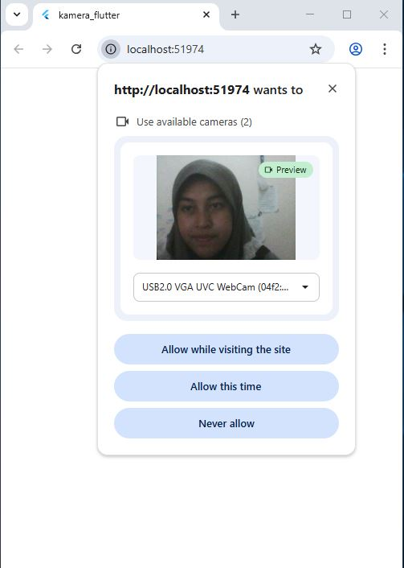

# #09 | Kamera

## Praktikum 1: Mengambil Foto dengan Kamera di Flutter 

## Praktikum 2: Membuat photo filter carousel

## Tugas Praktikum 
### 1. Selesaikan Praktikum 1 dan 2, lalu dokumentasikan dan push ke repository Anda berupa screenshot setiap hasil pekerjaan beserta penjelasannya di file README.md! Jika terdapat error atau kode yang tidak dapat berjalan, silakan Anda perbaiki sesuai tujuan aplikasi dibuat!
Semua langkah praktikum, sudah diselesaikan dan berjalan tanpa error.

### 2. Jelaskan maksud void async pada praktikum 1?
Penggunaan void async pada praktikum 1 yaitu, agar bisa menggunakan await untuk menunggu hasil operasi asynchronous sebelum aplikasi dijalankan. Sebagai contoh, pada praktikum 1 ini terdapat sesi untuk mengambil daftar kamera dari perangkat menggunakan availableCameras(), dan itu membutuhkan waktu serta tidak langsung tersedia secara sinkron. Oeh karena itu, dengan menandai main() sebagai async, Flutter menunggu proses pengambilan kamera selesai terlebih dahulu sebelum memanggil runApp(), sehingga aplikasi bisa langsung menggunakan kamera yang tersedia tanpa error.

### 3. Jelaskan fungsi dari anotasi @immutable dan @override ?
Anotasi @immutable digunakan untuk menandai bahwa sebuah kelas bersifat tidak berubah, artinya semua properti di dalamnya harus final sehingga objek yang dibuat dari kelas tersebut tidak dapat diubah setelah instansiasi, sehingga membantu menjaga konsistensi dan keamanan data dalam aplikasi. Sementara itu, anotasi @override digunakan untuk menandai bahwa sebuah method atau properti sengaja mengganti (menimpa) versi yang ada pada kelas induk, sehingga compiler dapat memeriksa kesesuaian implementasi dan mencegah kesalahan seperti salah penamaan atau tipe return yang tidak sesuai.
