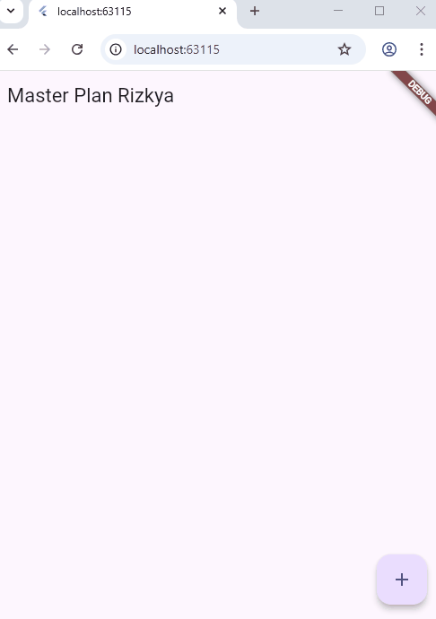
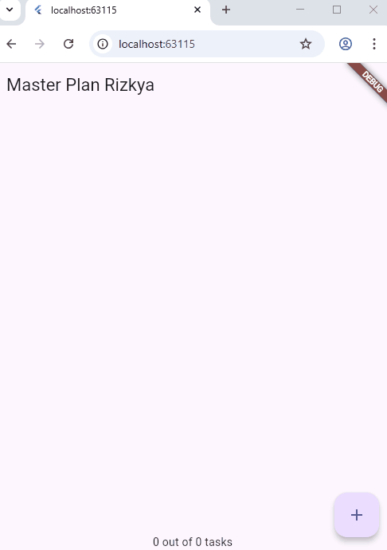
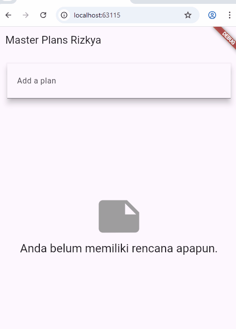

# #10 | Dasar State Management

## Tugas Praktikum 1: Dasar State dengan Model-View
### 1. Selesaikan langkah-langkah praktikum tersebut, lalu dokumentasikan berupa GIF hasil akhir praktikum beserta penjelasannya di file README.md! Jika Anda menemukan ada yang error atau tidak berjalan dengan baik, silakan diperbaiki.
Semua langkah praktikum, sudah diselesaikan dan berjalan tanpa error.

### 2. Jelaskan maksud dari langkah 4 pada praktikum tersebut! Mengapa dilakukan demikian?
Pada langkah tersebut, digunakan untuk membungkus beberapa data layer dalam satu file, sehingga jika file lain butuh tinggal diekspor kedua model tersebut. Selain itu, dengan menggunakan cara ini dapat membuat proses impor lebih ringkas.

### 3. Mengapa perlu variabel plan di langkah 6 pada praktikum tersebut? Mengapa dibuat konstanta ?
Variabel plan diperlukan, karena sebagai tempat menyimpan semua data Master Plan. Sementara dibuat konstanta, karena untuk membuat objek awal yang tetap dan efisien sehingga dapat lebih ringan di memori.

### 4. Lakukan capture hasil dari Langkah 9 berupa GIF, kemudian jelaskan apa yang telah Anda buat!

Dari hasil praktikum 1, saya berhasil membuat sebuah aplikasi untuk manajemen kegiatan - kegiatan. Terlihat bahwa saya dapat menambahkan banyak task seperti list. Selain itu, di setiap task juga bisa dicentang untuk menandai terselesainya kegiatan yang saya agendakan.

### 5. Apa kegunaan method pada Langkah 11 dan 13 dalam lifecyle state ?
Kegunaan method **"initState()"** pada langkah 11, yaitu untuk inisialisasi awal (membuat scrollController dan listener). Sementara kegunaan method **"dispose()"** pada langkah 13 yaitu, untuk membuang controller agar tidak memperbesar memori. 

## Tugas Praktikum 2: InheritedWidget
### 1. Selesaikan langkah-langkah praktikum tersebut, lalu dokumentasikan berupa GIF hasil akhir praktikum beserta penjelasannya di file README.md! Jika Anda menemukan ada yang error atau tidak berjalan dengan baik, silakan diperbaiki sesuai dengan tujuan aplikasi tersebut dibuat.
Semua langkah praktikum, sudah diselesaikan dan berjalan tanpa error.

### 2. Jelaskan mana yang dimaksud InheritedWidget pada langkah 1 tersebut! Mengapa yang digunakan InheritedNotifier?
InheritedWidget pada langkah 1 adalah PlanProvider, karena ia mewarisi InheritedNotifier (turunan dari InheritedWidget). Alasan penggunaan InheritedNotifier karena dapat otomatis memberi tahu widget turunan saat Plan diubah, sehingga UI selalu up-to-date tanpa memanggil setState secara manual.

### 3. Jelaskan maksud dari method di langkah 3 pada praktikum tersebut! Mengapa dilakukan demikian?
Pada langkah 3 terdapat 2 method yang digunakan, yaitu : 
- **completedCount** untuk menghitung jumlah task complete.
- **completenessMessage** untuk membuat kalimat progres berbentuk teks.

Alasan Ditempatkan di model agar logika data terpusat, bersih, dan mudah dipakai UI.

### 4. Lakukan capture hasil dari Langkah 9 berupa GIF, kemudian jelaskan apa yang telah Anda buat!

Dari hasil pengerjaan, saya sudah berhasil mengaplikasikan state management menggunakan ValueNotifier untuk menangani perubahan data pada objek Plan(). Selain itu, saya juga telah menambahkan footer teks yang sudah disesuaikan dengan kebutuhan tampilan aplikasi. Mekanisme pembaruan UI yang sebelumnya mengandalkan setState kini berhasil saya refactor menjadi lebih rapi dan terstruktur melalui penggunaan ValueNotifier dan Provider.

## Tugas Praktikum 3: State di Multiple Screens
### 1. Selesaikan langkah-langkah praktikum tersebut, lalu dokumentasikan berupa GIF hasil akhir praktikum beserta penjelasannya di file README.md! Jika Anda menemukan ada yang error atau tidak berjalan dengan baik, silakan diperbaiki sesuai dengan tujuan aplikasi tersebut dibuat.
Semua langkah praktikum, sudah diselesaikan dan berjalan tanpa error.

### 2. Berdasarkan Praktikum 3 yang telah Anda lakukan, jelaskan maksud dari gambar diagram berikut ini!

Diagram tersebut menjelaskan bahwa state aplikasi ditempatkan pada level yang lebih tinggi (Lift State Up) sehingga dapat diakses oleh lebih dari satu halaman. Setelah menambahkan halaman baru (PlanScreen) dan melakukan navigasi dengan Navigator.push, aplikasi kini mampu menampilkan lebih dari satu rencana. Perubahan ini membuat susunan widget tree ikut bergeser karena tampilan di screen baru memiliki struktur berbeda. Meskipun berpindah halaman, data tetap tersinkronisasi karena seluruh screen mengambil state yang sama melalui PlanProvider.

### 3. Lakukan capture hasil dari Langkah 14 berupa GIF, kemudian jelaskan apa yang telah Anda buat!

Pada langkah ini, saya menambahkan sebuah screen baru agar aplikasi Master Plan dapat menampilkan lebih dari satu daftar plan. Dengan menerapkan konsep ‘Lift State Up’, state dari setiap Plan ditempatkan di level yang lebih tinggi sehingga bisa diakses oleh lebih dari satu halaman. Kini aplikasi yang saya buat bisa menampilkan daftar banyak plan, membuka salah satu plan, dan mempertahankan state secara konsisten menggunakan PlanProvider.
